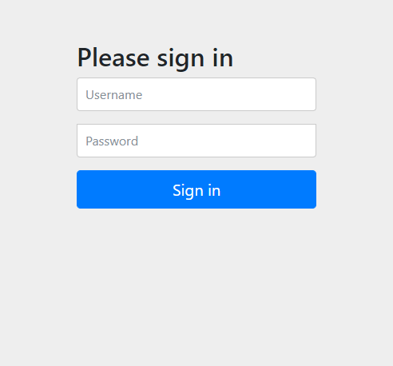
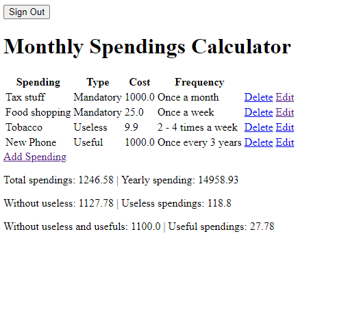
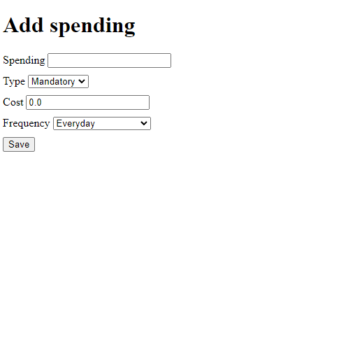
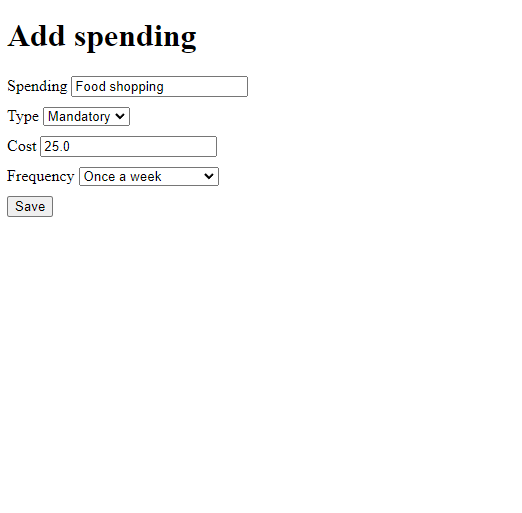

# MonthlySpendings
App to calculate monthly spending on necessities and other stuff.

**User Login**  
Username: user  
Password: user  

**Admin Login**  
Username: admin  
Password: admin  

Add, remove and/or edit spendings and see the frontpage (spendinglist) for a list of your spendings and different kinds of calculations.

<h2>About</h2>
This very simple java web application is made by Jong Lau for Haaga-Helias server programming course as a course project work. The projects idea was to use java and Spring to create an application that is very well written in the backend and frontend can be left barebones.

 
The application is made by having multiple repositories like Frequency, Spending, Type, etc to have a controller file that takes all the possible variables, calculates them and outputs them in the website. The login is has password hashing for security but for showing off the project the login informations are listed in top. Login screen itself is provided by Spring so it visually looks better than other parts of the project.

 
<h1>Login Screen</h1>

<h1>Front Page</h1>

<h1>Add Spending</h1>

<h1>Edit Existing Spending</h1>

